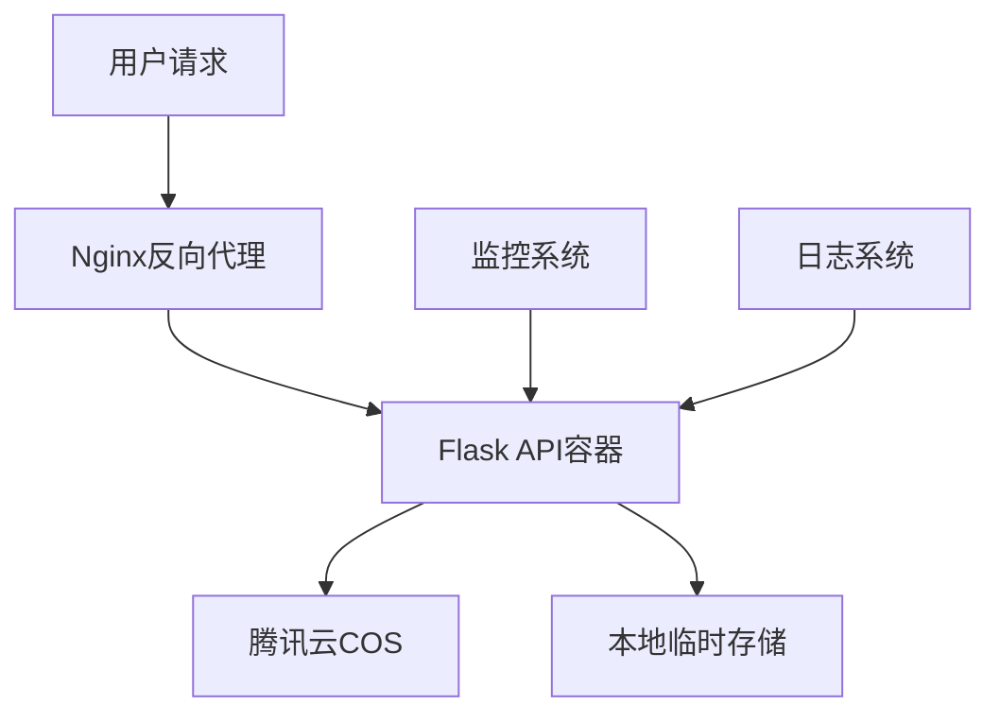
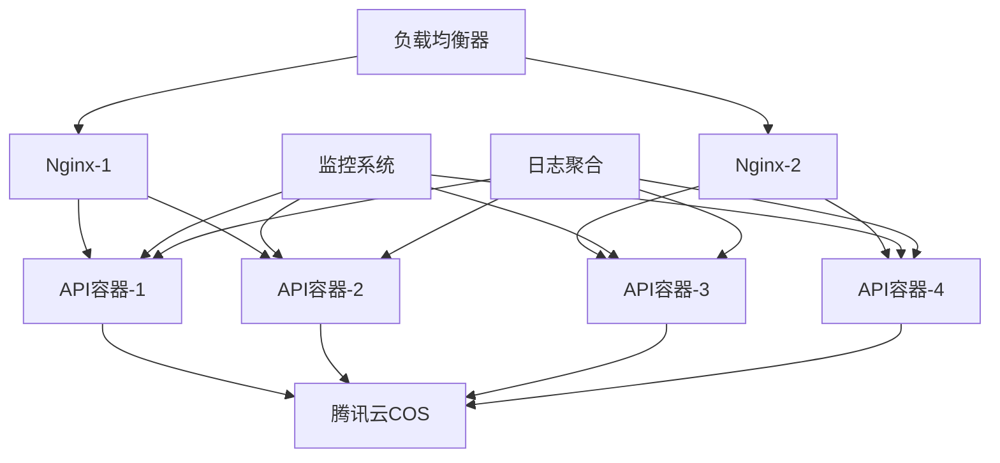

# PPT文件超链接转换系统 - 部署方案文档

## 📋 目录

- [系统概述](#系统概述)
- [环境要求](#环境要求)
- [部署方式选择](#部署方式选择)
- [快速部署方案](#快速部署方案)
- [生产环境部署方案](#生产环境部署方案)
- [Docker镜像部署方案](#docker镜像部署方案)
- [高可用生产环境方案](#高可用生产环境方案)
- [部署后验证](#部署后验证)
- [运维管理](#运维管理)
- [故障排除](#故障排除)
- [性能优化](#性能优化)

---

## 系统概述

PPT文件超链接转换系统是一个基于Flask的RESTful API服务，提供以下核心功能：

- 🔗 自动识别PPTX中的媒体链接（.mp3, .mp4, .wav等）
- 🎮 识别特定格式的游戏链接（index.html?data_url=...json）
- ⚡ 将识别的链接转换为可点击的超链接
- ☁️ 自动上传处理后的文件到腾讯云COS
- 🐳 支持Docker容器化部署

---

## 环境要求

### 最低系统要求

| 组件 | 最低要求 | 推荐配置 |
|------|----------|----------|
| **操作系统** | Linux (Ubuntu 18.04+, CentOS 7+) | Ubuntu 20.04 LTS |
| **CPU** | 1核 | 2核+ |
| **内存** | 1GB | 2GB+ |
| **存储** | 5GB | 20GB+ |
| **网络** | 出站访问腾讯云COS | 稳定网络连接 |

### 软件依赖

| 软件 | 版本要求 | 安装说明 |
|------|----------|----------|
| **Docker** | 20.10+ | 必需 |
| **Docker Compose** | 1.28+ | 推荐 |
| **Python** | 3.11+ | 容器内自动安装 |
| **Nginx** | 1.18+ | 生产环境推荐 |
| **curl** | 任意版本 | 用于健康检查 |

---

## 部署方式选择

根据您的使用场景选择合适的部署方式：

| 场景 | 推荐方案 | 复杂度 | 部署时间 |
|------|----------|--------|----------|
| **开发测试** | [快速部署方案](#快速部署方案) | ⭐ | 5分钟 |
| **小型生产** | [生产环境部署方案](#生产环境部署方案) | ⭐⭐ | 10分钟 |
| **企业生产** | [高可用生产环境方案](#高可用生产环境方案) | ⭐⭐⭐ | 30分钟 |
| **CI/CD集成** | [Docker镜像部署方案](#docker镜像部署方案) | ⭐⭐ | 15分钟 |

---

## 快速部署方案

适用于开发测试环境，快速验证功能。

### 步骤 1: 准备部署文件

```bash
# 在本地打包项目
cd "d:\code"
tar -czf ppt_hyperlink.tar.gz ppt_hyperlink/

# 传输到服务器
scp ppt_hyperlink.tar.gz username@server-ip:/home/username/
```

### 步骤 2: 服务器环境准备

```bash
# 登录服务器
ssh username@server-ip

# 安装Docker（如果未安装）
# Ubuntu/Debian
sudo apt update
sudo apt install -y docker.io docker-compose

# CentOS/RHEL
sudo yum install -y docker docker-compose

# 启动Docker服务
sudo systemctl start docker
sudo systemctl enable docker

# 将用户加入docker组（可选）
sudo usermod -aG docker $USER
```

### 步骤 3: 部署应用

```bash
# 解压项目文件
tar -xzf ppt_hyperlink.tar.gz
cd ppt_hyperlink/

# 使用一键部署脚本
bash deploy.sh
```

### 步骤 4: 验证部署

```bash
# 检查服务状态
curl http://localhost:5000/health

# 查看容器状态
docker-compose ps
```

**预期结果：**
- API服务运行在 `http://server-ip:5000`
- 健康检查返回 `{"status": "healthy"}`

---

## 生产环境部署方案

适用于生产环境，包含完整的监控和日志配置。

### 方案概述



### 步骤 1: 一键部署脚本

```bash
# 在本地执行（自动化整个部署过程）
cd "d:\code\ppt_hyperlink"
bash prod-deploy.sh <server-ip> <username>

# 例如
bash prod-deploy.sh 192.168.1.100 ubuntu
```

### 步骤 2: 配置Nginx反向代理

```bash
# 在服务器上安装Nginx
sudo apt install -y nginx  # Ubuntu/Debian
# 或
sudo yum install -y nginx  # CentOS/RHEL

# 复制Nginx配置文件
sudo cp nginx.conf /etc/nginx/sites-available/ppt-api
sudo ln -s /etc/nginx/sites-available/ppt-api /etc/nginx/sites-enabled/

# 修改配置文件中的域名
sudo nano /etc/nginx/sites-available/ppt-api
# 将 your-domain.com 替换为实际域名或IP

# 测试配置并重启
sudo nginx -t
sudo systemctl restart nginx
```

### 步骤 3: 配置防火墙

```bash
# Ubuntu/Debian (使用ufw)
sudo ufw allow 80/tcp
sudo ufw allow 443/tcp
sudo ufw allow 5000/tcp  # 如果需要直接访问API

# CentOS/RHEL (使用firewalld)
sudo firewall-cmd --permanent --add-service=http
sudo firewall-cmd --permanent --add-service=https
sudo firewall-cmd --permanent --add-port=5000/tcp
sudo firewall-cmd --reload
```

### 步骤 4: 配置SSL证书（推荐）

```bash
# 使用Let's Encrypt免费证书
sudo apt install -y certbot python3-certbot-nginx

# 获取SSL证书
sudo certbot --nginx -d your-domain.com

# 设置自动续期
sudo crontab -e
# 添加以下行：
# 0 12 * * * /usr/bin/certbot renew --quiet
```

**部署结果：**
- HTTP访问：`http://your-domain.com`
- HTTPS访问：`https://your-domain.com`
- 直接API访问：`http://your-domain.com:5000`

---

## Docker镜像部署方案

适用于CI/CD集成和镜像分发场景。

### 方案 A: 本地构建和传输

```bash
# 1. 构建Docker镜像
cd "d:\code\ppt_hyperlink"
docker build -t ppt-hyperlink-converter:v1.0 .

# 2. 保存镜像为文件
docker save -o ppt-hyperlink-converter-v1.0.tar ppt-hyperlink-converter:v1.0

# 3. 传输到服务器
scp ppt-hyperlink-converter-v1.0.tar username@server-ip:/home/username/

# 4. 在服务器上加载并运行
ssh username@server-ip
docker load -i ppt-hyperlink-converter-v1.0.tar
docker run -d \
  --name ppt-api \
  --restart unless-stopped \
  -p 5000:5000 \
  -v /tmp:/tmp \
  ppt-hyperlink-converter:v1.0
```

### 方案 B: Docker Registry

```bash
# 1. 推送到Docker Hub（需要Docker Hub账号）
docker login
docker tag ppt-hyperlink-converter:v1.0 yourusername/ppt-hyperlink-converter:v1.0
docker push yourusername/ppt-hyperlink-converter:v1.0

# 2. 在服务器上拉取运行
ssh username@server-ip
docker pull yourusername/ppt-hyperlink-converter:v1.0
docker run -d \
  --name ppt-api \
  --restart unless-stopped \
  -p 5000:5000 \
  -v /tmp:/tmp \
  yourusername/ppt-hyperlink-converter:v1.0
```

### 方案 C: 私有Registry

```bash
# 搭建私有Registry
docker run -d \
  --name registry \
  --restart unless-stopped \
  -p 5000:5000 \
  -v /opt/registry:/var/lib/registry \
  registry:2

# 推送镜像到私有Registry
docker tag ppt-hyperlink-converter:v1.0 registry-server:5000/ppt-hyperlink-converter:v1.0
docker push registry-server:5000/ppt-hyperlink-converter:v1.0
```

---

## 高可用生产环境方案

适用于企业级生产环境，提供高可用性和负载均衡。

### 架构图



### 步骤 1: 多实例部署

```bash
# 创建生产环境配置
cd ppt_hyperlink/

# 启动多个API实例
docker-compose -f docker-compose.prod.yml up -d --scale ppt-hyperlink-converter=4
```

### 步骤 2: 负载均衡配置

创建高级Nginx配置：

```nginx
# /etc/nginx/conf.d/ppt-api-lb.conf
upstream ppt_api {
    least_conn;
    server 127.0.0.1:5001 max_fails=3 fail_timeout=30s;
    server 127.0.0.1:5002 max_fails=3 fail_timeout=30s;
    server 127.0.0.1:5003 max_fails=3 fail_timeout=30s;
    server 127.0.0.1:5004 max_fails=3 fail_timeout=30s;
}

server {
    listen 80;
    server_name your-domain.com;

    client_max_body_size 100M;

    location / {
        proxy_pass http://ppt_api;
        proxy_set_header Host $host;
        proxy_set_header X-Real-IP $remote_addr;
        proxy_set_header X-Forwarded-For $proxy_add_x_forwarded_for;
        proxy_set_header X-Forwarded-Proto $scheme;

        proxy_connect_timeout 60s;
        proxy_send_timeout 300s;
        proxy_read_timeout 300s;

        proxy_next_upstream error timeout invalid_header http_500 http_502 http_503;
    }

    location /health {
        proxy_pass http://ppt_api/health;
        access_log off;
    }
}
```

### 步骤 3: 监控配置

创建监控脚本：

```bash
#!/bin/bash
# monitor.sh - 服务监控脚本

check_service() {
    local port=$1
    local service_name=$2

    if curl -f http://localhost:$port/health > /dev/null 2>&1; then
        echo "✅ $service_name (port $port) - 正常"
        return 0
    else
        echo "❌ $service_name (port $port) - 异常"
        return 1
    fi
}

echo "=== PPT API 服务监控 $(date) ==="

# 检查各个实例
check_service 5001 "API实例1"
check_service 5002 "API实例2"
check_service 5003 "API实例3"
check_service 5004 "API实例4"

# 检查Nginx
if systemctl is-active --quiet nginx; then
    echo "✅ Nginx - 正常"
else
    echo "❌ Nginx - 异常"
fi

# 检查磁盘空间
disk_usage=$(df -h /tmp | awk 'NR==2 {print $5}' | sed 's/%//')
if [ $disk_usage -gt 80 ]; then
    echo "⚠️  磁盘使用率: ${disk_usage}% (建议清理)"
else
    echo "✅ 磁盘使用率: ${disk_usage}%"
fi
```

### 步骤 4: 自动化部署脚本

```bash
#!/bin/bash
# ha-deploy.sh - 高可用部署脚本

set -e

echo "=== 高可用生产环境部署 ==="

# 停止旧服务
echo "🛑 停止旧服务..."
docker-compose -f docker-compose.prod.yml down

# 拉取最新镜像
echo "📥 拉取最新镜像..."
docker-compose -f docker-compose.prod.yml pull

# 启动多实例服务
echo "🚀 启动多实例服务..."
docker-compose -f docker-compose.prod.yml up -d --scale ppt-hyperlink-converter=4

# 等待服务启动
echo "⏳ 等待服务启动..."
sleep 30

# 健康检查
echo "🔍 执行健康检查..."
bash monitor.sh

# 重载Nginx配置
echo "🔄 重载Nginx配置..."
sudo nginx -t && sudo systemctl reload nginx

echo "✅ 高可用部署完成！"
```

---

## 部署后验证

### 基础功能验证

```bash
# 1. 健康检查
curl -f http://your-domain.com/health
# 期望返回: {"status": "healthy", "service": "PPT Hyperlink Converter"}

# 2. API文档检查
curl http://your-domain.com/
# 期望返回: API文档JSON

# 3. 功能测试（使用测试文件）
curl -X POST \
     -H "Content-Type: application/json" \
     -d '{"pptx_url": "https://example.com/test.pptx"}' \
     http://your-domain.com/process_pptx
```

### 性能验证

```bash
# 并发测试
for i in {1..10}; do
    curl -X POST \
         -H "Content-Type: application/json" \
         -d '{"pptx_url": "https://example.com/test.pptx"}' \
         http://your-domain.com/process_pptx &
done
wait
```

### 监控验证

```bash
# 检查容器状态
docker-compose ps

# 检查资源使用
docker stats

# 检查日志
docker-compose logs -f --tail=50
```

---

## 运维管理

### 日常运维命令

```bash
# 查看服务状态
docker-compose ps

# 查看实时日志
docker-compose logs -f

# 重启服务
docker-compose restart

# 更新服务
docker-compose pull && docker-compose up -d

# 扩容服务
docker-compose up -d --scale ppt-hyperlink-converter=6

# 缩容服务
docker-compose up -d --scale ppt-hyperlink-converter=2
```

### 备份和恢复

```bash
# 备份配置文件
tar -czf ppt-api-backup-$(date +%Y%m%d).tar.gz \
    docker-compose*.yml \
    nginx.conf \
    *.sh

# 备份Docker镜像
docker save -o ppt-api-image-backup.tar ppt-hyperlink-converter:latest

# 恢复服务
tar -xzf ppt-api-backup-*.tar.gz
docker load -i ppt-api-image-backup.tar
docker-compose up -d
```

### 日志管理

```bash
# 设置日志轮转
sudo tee /etc/logrotate.d/ppt-api << EOF
/var/log/nginx/ppt-api-*.log {
    daily
    missingok
    rotate 7
    compress
    delaycompress
    notifempty
    postrotate
        systemctl reload nginx
    endscript
}
EOF

# 清理Docker日志
docker system prune -f
docker logs --since="24h" ppt_api > /dev/null
```

---

## 故障排除

### 常见问题及解决方案

#### 1. 服务无法启动

**症状：** `docker-compose up` 失败
```bash
# 检查Docker状态
sudo systemctl status docker

# 检查端口占用
sudo netstat -tlnp | grep :5000

# 检查配置文件
docker-compose config

# 查看详细错误
docker-compose up --no-deps
```

#### 2. API请求超时

**症状：** 请求处理时间过长
```bash
# 检查系统资源
top
df -h

# 检查容器资源
docker stats

# 增加超时设置
# 在nginx.conf中调整 proxy_read_timeout
```

#### 3. 腾讯云COS上传失败

**症状：** 上传返回错误
```bash
# 验证COS配置
curl -X POST \
     -H "Content-Type: application/json" \
     -d '{"test": "cos_config"}' \
     http://localhost:5000/health

# 检查网络连接
ping cos.ap-nanjing.myqcloud.com

# 验证访问密钥
# 检查app.py中的COS配置
```

#### 4. 内存不足

**症状：** 容器被杀死（OOMKilled）
```bash
# 增加内存限制
# 在docker-compose.yml中添加：
# deploy:
#   resources:
#     limits:
#       memory: 2G

# 或者升级服务器配置
```

### 调试模式

```bash
# 启用调试模式
export FLASK_ENV=development
export FLASK_DEBUG=1

# 或者修改docker-compose.yml:
# environment:
#   - FLASK_ENV=development
#   - FLASK_DEBUG=1

# 重启服务
docker-compose restart
```

### 日志分析

```bash
# 实时查看API日志
docker logs -f ppt_api

# 分析Nginx访问日志
tail -f /var/log/nginx/ppt-api-access.log

# 分析错误日志
tail -f /var/log/nginx/ppt-api-error.log

# 统计API调用情况
awk '{print $7}' /var/log/nginx/ppt-api-access.log | sort | uniq -c | sort -nr
```

---

## 性能优化

### 系统级优化

```bash
# 调整系统文件描述符限制
echo "* soft nofile 65536" | sudo tee -a /etc/security/limits.conf
echo "* hard nofile 65536" | sudo tee -a /etc/security/limits.conf

# 优化网络参数
sudo tee -a /etc/sysctl.conf << EOF
net.core.somaxconn = 65535
net.ipv4.tcp_max_syn_backlog = 65535
net.ipv4.tcp_fin_timeout = 30
EOF
sudo sysctl -p
```

### 应用级优化

```bash
# 启用并发处理
# 在docker-compose.yml中增加环境变量：
# environment:
#   - FLASK_ENV=production
#   - PYTHONUNBUFFERED=1
#   - WORKERS=4  # 设置worker数量
```

### 缓存优化

```bash
# 配置Redis缓存（可选）
# 在docker-compose.yml中添加Redis服务：
# redis:
#   image: redis:alpine
#   ports:
#     - "6379:6379"
#   restart: unless-stopped
```

### 监控指标

建立监控指标收集：

```bash
# 创建监控脚本
cat > /usr/local/bin/ppt-api-metrics.sh << 'EOF'
#!/bin/bash
echo "timestamp,cpu_usage,memory_usage,disk_usage,api_response_time"
while true; do
    timestamp=$(date '+%Y-%m-%d %H:%M:%S')
    cpu_usage=$(top -bn1 | grep "Cpu(s)" | awk '{print $2}' | cut -d'%' -f1)
    memory_usage=$(free | grep Mem | awk '{printf "%.1f", $3/$2 * 100.0}')
    disk_usage=$(df -h /tmp | awk 'NR==2 {print $5}' | sed 's/%//')
    api_response_time=$(curl -w "%{time_total}" -s -o /dev/null http://localhost:5000/health)

    echo "$timestamp,$cpu_usage,$memory_usage,$disk_usage,$api_response_time"
    sleep 60
done
EOF

chmod +x /usr/local/bin/ppt-api-metrics.sh
```

---

## 安全建议

### 基础安全配置

```bash
# 1. 更新系统
sudo apt update && sudo apt upgrade -y

# 2. 配置防火墙
sudo ufw enable
sudo ufw default deny incoming
sudo ufw default allow outgoing
sudo ufw allow ssh
sudo ufw allow 80/tcp
sudo ufw allow 443/tcp

# 3. 禁用不必要的服务
sudo systemctl disable bluetooth
sudo systemctl disable cups

# 4. 设置自动安全更新
sudo apt install -y unattended-upgrades
sudo dpkg-reconfigure -plow unattended-upgrades
```

### API安全

```bash
# 1. 添加API密钥认证（可选）
# 在app.py中添加认证中间件

# 2. 限制请求频率
# 使用nginx限制：
# limit_req_zone $binary_remote_addr zone=api:10m rate=10r/s;
# limit_req zone=api burst=20 nodelay;

# 3. 隐藏服务器信息
# 在nginx.conf中添加：
# server_tokens off;
```

---

## 总结

本文档提供了PPT文件超链接转换系统的完整部署方案，包括：

✅ **4种部署方式**：从简单到复杂，适应不同场景需求
✅ **详细步骤说明**：每个步骤都有具体的命令和预期结果
✅ **完整的运维指南**：包含监控、备份、故障排除等
✅ **性能优化建议**：系统级和应用级的优化方案
✅ **安全配置建议**：保障生产环境安全

### 快速选择指南

| 需求 | 推荐方案 | 部署时间 |
|------|----------|----------|
| 快速测试 | 快速部署方案 | 5分钟 |
| 小团队使用 | 生产环境部署方案 | 15分钟 |
| 企业级应用 | 高可用生产环境方案 | 30分钟 |

选择适合您的方案，按照文档步骤执行即可快速部署PPT超链接转换系统！

---

📞 **技术支持**：如果在部署过程中遇到问题，请检查[故障排除](#故障排除)章节或查看项目日志。